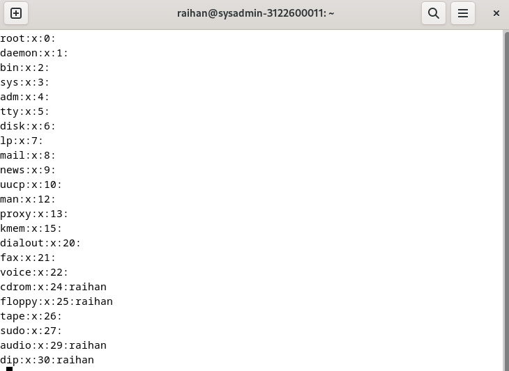

```copy code 
Nama             : Muhammad Arief Satria Wibawa
NRP              : 3122600015
Kelas            : D4 IT A
Dosen Pengampu   : Dr. Ferry Astika Saputra S.T., M.Sc

_________________________________________________________
|                       Daftar tugas                    |
|-------------------------------------------------------|
|   Instalasi Debian                                    |
|   Penjelasan role yang ada pada linux                 |
|   Perbedaan command su dengan su -                    |
|   Penjelasan mengenai $less /etc/group                |
|   Penjelasan mengenai $less /etc/group                |
|   Penjelasan fungsi sudo                              |
|   Menjalankan langkah penambahan user sbg user sudo   |

```

<details>
<summary>

**<h1 style="font-family:bahnschrift;">Instalasi Debian Linux menggunakan Virtual Box</h1>**
>Proses instalasi debian 12 menggunakan virtual box

</summary>

**<h3 style="font-family:bahnschrift;">Pra instalasi</h3>**
- Setelah men-download file iso dari debian 12(yang mahasiswa gunakan), buka vbox, lalu klik new

    <br><br>

- Kemudian, user akan diarahkan ke pemilihan iso file. Ketikkan path dimana user ingin menyimpan OS ini pada bagian folder, serta file debian iso disimpan di bagian ISO image, serta check pada pilihan 'skip unattended installation'
  <br><br>

- kemudian, pilih memory dan processor, disesuaikan dengan hardware milik user, lalu klik next.
  <br><br>

- kemudian, pilih size virtual hard disk yang diinginkan. Namun, perlu disesuaikan dengan kemampuan hardware user. 
  <br><br>

**<h3 style="font-family:bahnschrift;">Instalasi</h3>**

- Lalu klik next, maka user akan masuk ke halaman pertama instalasi, lalu pilih graphical install
  <br><br>

- Lalu, user akan dibawa ke tampilan berikut untuk setting bahasa, lokasi, serta keyboard
  <br><br>
  <br><br>
  <br><br>
  <br><br>

- Setelah itu, user melakukan setting hostname, username, serta password
    <br><br>
    <br>
    <br>
    <br>
    <br>
    <br>

- Kemudian, user dapat memilih zona waktu, sesuai dengan kebutuhan
    <br><br>

- Setelah itu, user bisa melakukan setting disk secara manual
    <br><br>
- Setting storage sedemikian rupa menjadi berikut : 
  1. 20gb untuk keperluan OS
  2. 1.8gb untuk swap area
  3. 5gb untuk keperluan lain
   
    <br><br>
- kemudian tunggu proses instalasi base systemnya
    <br><br>

- Setelah itu, anda diminta untuk memilih debian archive mirror (disarankan menggunakan mirror pada region user)
    <br><br>
    
- Kemudian, tunggu proses instalasinya selesai. Proses ini bisa memakan waktu yang cukup lama, tergantung pada koneksi internet dari user
  <br><br>

- Setelah selesai, user diberi pilihan apakah ingin menginstall GRUB boot loader atau tidak. Lalu ketik yes untuk menginstallnya, kemudian klik device yang tersedia, lalu continue
  <br><br>

- Setelah proses instalasi selesai, akan muncul notifikasi berikut 
  <br><br>


**<h2 style="font-family:bahnschrift;">Setup akhir</h3>**
- Setelah itu, anda bisa login ke OS debian dan siap digunakan
  <br><br>

- User juga diminta untuk melakukan beberapa setup sebagai berikut
    <br><br>
    <br>
    <br>

</details>

<details>
<summary>

**<h1 style="font-family:bahnschrift;">Role yang ada pada linux</h1>**
>Macam-macam role yang ada pada linux

</summary>

1. User (Pengguna):
    >Pengguna adalah individu yang dapat mengakses sistem. Masing-masing pengguna memiliki akunnya sendiri dengan hak akses tertentu.
    
    >Tugas: Mengelola file pribadi, menjalankan perintah di terminal, dan menggunakan sumber daya sistem.

2. Root (Superuser):

    >Root adalah pengguna dengan hak akses tertinggi. Hak akses root memungkinkan pengguna untuk melakukan perubahan sistem kritis.
    
    >Tugas: Menginstal dan menghapus perangkat lunak, mengelola pengguna, mengkonfigurasi sistem, dan melakukan tugas administratif lainnya.

3. Administrator (sudo):

    > Pengguna yang diberi hak akses khusus melalui konfigurasi sudo.   Administrator dapat menjalankan perintah dengan hak akses root sesaat.
    
    >Tugas: Menjalankan perintah dengan hak akses tambahan, membantu dalam administrasi sistem.

4. Sysadmin (Administrator Sistem):

    >Seorang administrator sistem memiliki tanggung jawab untuk merawat dan mengelola infrastruktur IT.

    >Tugas: Memastikan keamanan, ketersediaan, dan kinerja sistem, serta melakukan pemeliharaan dan pemecahan masalah.

5. Network Administrator (Administrator Jaringan):

    >Bertanggung jawab atas infrastruktur jaringan dan koneksi di dalam dan di luar sistem.

    > Tugas: Konfigurasi jaringan, pemecahan masalah koneksi, manajemen firewall, dan keamanan jaringan.

6. Database Administrator (Administrator Basis Data):

    > Bertanggung jawab atas manajemen dan kinerja basis data pada sistem.
    
    > Tugas: Pemasangan, konfigurasi, pemeliharaan, backup, dan pemulihan basis data.

7. Web Server (Pelayan Web):

    >Merujuk pada peran mesin yang menyediakan layanan web, seperti Apache atau Nginx.

    >Tugas: Menyajikan halaman web, menangani permintaan HTTP, dan menyediakan aplikasi web.

8. File Server (Pelayan File):

    >Berfungsi sebagai pusat penyimpanan dan distribusi file di dalam jaringan.

    >Tugas: Berbagi file, mengelola izin akses, dan menyediakan penyimpanan berbasis jaringan (NAS).
</details>


<details>
<summary>

**<h1 style="font-family:bahnschrift;">Perbedaan su dan su - pada linux</h1>**
  >command su pada linux memungkinkan user untuk mempertahankan current user environtment ketika switch user. Sedangkan su - digunakan untuk mengeksekusi shell login untuk transfer user account tertentu, serta secara umum mengubah environtment variables dan working directory set di environtmen milik user tertentu.

</summary>

**<h3 style="font-family:bahnschrift;">Perintah su</h3>**

  Pada command ini, user dapat beralih ke user lain secara spesifik. Jika user tidak memilih user secara spesifik, maka linux secara default akan masuk ke root. Dengan menjalankan command su, ueser bisa switch ke user lain tanpa harus menjalankan login shell, dan environtment variables yang sudah di set pada akun saat ini tidak akan diubah.

- **contoh :** 
``` 
$ su arief
```
>dengan menjalankan perintah tersebut, user saat ini akan dialihkan ke user yang bernama 'arief' tanpa perlu menjalankan login shell, serta setting environtment variables yang tetap.

**<h3 style="font-family:bahnschrift;">Perintah su -</h3>**
  >Pada command ini, user dapat beralih ke user lain, sama seperti perintah su. Namun, setting dari user saat ini akan diubah, dan environtment variables dari main user akan dihapus. 
- **contoh :**
```
$ su - arief 
```
>perintah ini digunakan untuk beralih ke user 'arief' dengan menjalankan shell login. Jika user tidak menentukan user secara spesifik ke perintah ini, maka secara default user akan masuk ke Root.
</details>


<details>
<summary>

**<h1 style="font-family:bahnschrift;">Penjelasan mengenai $less /etc/group</h1>**

>

</summary>

<br><br>

Command ini akan membuka berkas group yang terletak di direktori /etc/ menggunakan less. less digunakan untuk melihat isi berkas secara bertahap dan memungkinkan untuk melakukan navigasi dengan lebih mudah. Kita dapat menggunakan tombol "Page Up" dan "Page Down", dan berbagai opsi lainnya untuk membaca dan menjelajahi isi berkas tersebut.

</details>

    


