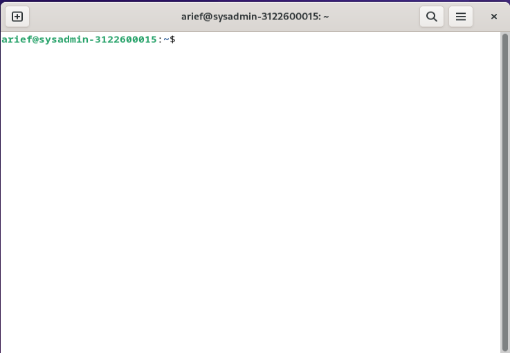
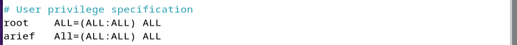

```copy code 
Nama             : Muhammad Arief Satria Wibawa
NRP              : 3122600015
Kelas            : D4 IT A
Dosen Pengampu   : Dr. Ferry Astika Saputra S.T., M.Sc
```
**<h1 style="font-family:bahnschrift;">Fungsi dari sudo</h1>**
>Fungsi dari perintah sudo ialah

**<h3 style="font-family:bahnschrift;">Langkah-langkah penambahan user sebagai user sudo</h3>**
- Buka terminal dan ketik su untuk masuk ke user
  <br><br>
- Ketikkan perintah su untuk masuk ke user root
  <br><br>
- Ketikkan perintah sudo visudo untuk membuka konfigurasi sudoers
  <br><br>
  <br><br>
- Pada bagian ```#User privilege spesification``` tambahkan user dibawah user root
  <br><br>
- Kemudian, ketik ctrl+x untuk keluar, namum save terlebih dahulu
  <br><br>
- Kemudian exit dari user root
  <br><br>