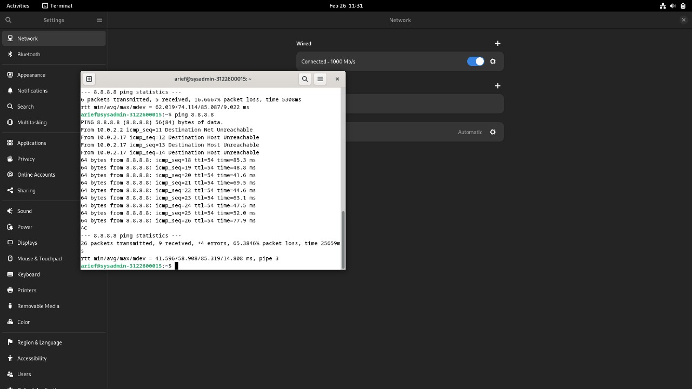

```copy code 
Nama             : Muhammad Arief Satria Wibawa
NRP              : 3122600015
Kelas            : D4 IT A
Dosen Pengampu   : Dr. Ferry Astika Saputra S.T., M.Sc
```

```copy code 
Daftar isi : 
- Tugas 1
    Standar struktur pada linux
- Tugas 2 
    Slide dasar Administrasi Sistem Jaringan
- Tugas 3
    Mengubah DHCP Manual
```

**<h1 style="font-family:bahnschrift;">Tugas 1</h1>**
**<h2 style="font-family:bahnschrift;">Standar struktur direktori pada linux</h2>**
    <br><br>

>tiap direktori memiliki artinya masing-masing, diantaranya : 

- ```/root```
    Ini merupakan direktori utama dimana semua operasi linux ada di sini. Direktori ini membawahi semua direktori sistem yang ada pada linux.
- ```/boot```
    Ini merupakan direktori dimana Boot Loader (file yang digunakan oleh sistem untuk booting) berada, seperti GRUB atau lilo, kernel, dan sebagainya. 
- ```/dev```
    Ini merupakan direktori dimana file-file sistem yang esensial, driver, serta perangkat yang terhubung tersimpan. Perangkat yang terhubung pada komputer akan dianggap file oleh linux, dan disimpan pada direktori ini.
- ```/etc```
    Ini merupakan direktori dimana konfigurasi file sistem berada. 
- ```/home```
    Ini merupakan direktori dimana file-file milik masing-masing user selain root disimpan
- ```/media```
    Ini merupakan direktori dimana user dapat men-mount removable media, seperti CD-ROM, USB, dsb.
- ```/mnt```
    Ini merupakan direktori dimana user dapat men-mount filesystem sementara. Biasanya digunakan untuk troubleshoot dari CDROM dan mengedit konfigurasinya.
- ```/opt```
    Direktori ini menyimpan software yang diinstall oleh user yang berasal dari distro lain. Direktori ini jarang digunakan di Linux untuk Optional Software Packages. 
- ```/proc```
    Direktori ini digunakan untuk informasi tentang proses, perangkat keras, jaringan, dan konfigurasi kernel secara dinamis.
- ```/storage```
    Direktori ini merupakan mount point dari partisi yang sudah dibuat sebelumnya.
- ```/sys```
    Direktori ini menyimpan firmware, kernel, dan file-file yang berkaitan.
- ```/tmp```
    Digunakan untuk menyimpan file sementara, yang akan dihapus ketika system melakukan reboot. 
- ```/usr```
    Direktori ini merupakan sub-hierarki dari direktori root yang berisi aplikasi dan tools yang bisa digunakan oleh user yang tidak esensial, seperti bin, sbin, dan lib. 
- ```/var```
    Direktori ini digunakan untuk menyimpan logs, lock files, crontlab, running process dsb. 
- ```/usr/bin```
    Direktori ini menyimpan program binary milik user, yang nantinya akan digunakan dalam mode single user.
- ```/usr/sbin```
    Direktori ini menyimpan System Binary dan System administration tools, yang digunakan jika bagi user root.
- ```/usr/lib```
    Ini merupakan direktori dimana file-file penting yang dibutuhkan oleh file binary disimpan.
- ```/usr/tmp```
    Merupakan direktori dimana file sementara disimpan, namun tidak terhapus ketika reboot.

**<h1 style="font-family:bahnschrift;">Tugas 2</h1>**
**<h2 style="font-family:bahnschrift;">Dasar Sistem Administrasi</h2>**
<br><br>
<br><br>
<br><br>
<br><br>
<br><br>
<br><br>
<br><br>
<br><br>

**<h1 style="font-family:bahnschrift;">Tugas 3</h1>**
**<h2 style="font-family:bahnschrift;">Mengubah DHCP Manual</h2>**

**<h3 style="font-family:bahnschrift;">1. Menuju ke setting->network lalu klik ikon + seperti pada gambar.</h3>**
  <br><br>

**<h3 style="font-family:bahnschrift;">2. Ubah konfigurasi address dan DNS seperti pada gambar.</h3>**
  <br><br>

**<h3 style="font-family:bahnschrift;">3. Tes ping ke DNS google melalui terminal.</h3>**
  <br><br>
