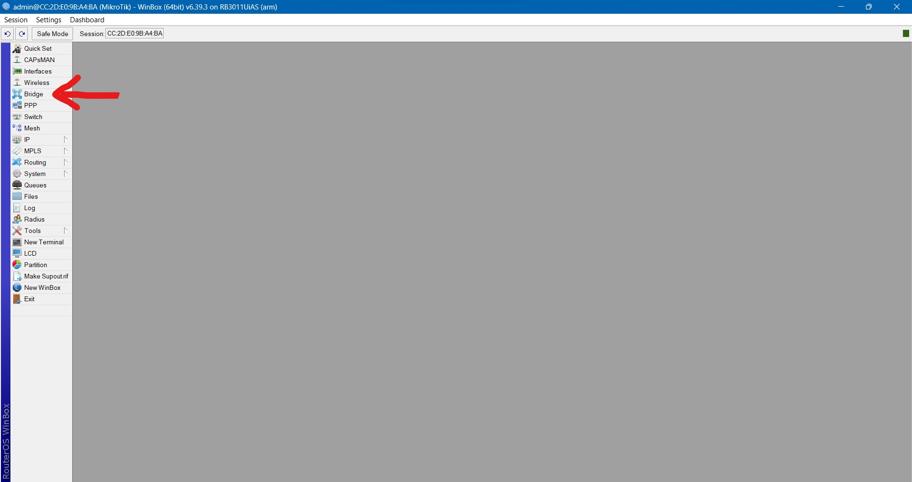

```copy code 
Nama             : Muhammad Arief Satria Wibawa
NRP              : 3122600015
Kelas            : D4 IT A
Dosen Pengampu   : Dr. Ferry Astika Saputra S.T., M.Sc
```

- # _Konfigurasi Mikrotik dengan Winbox untuk Internet_ 
**<h3 style="font-family:bahnschrift;">1. Menuju IP->Adresses lalu tambahkan pada address list.</h3>**
<p align="center">
  <br><br>
</p> 

- <div class ="isi" style="font-family:bahnschrift;"> Isi address untuk router sesuai nomor kelompok<br>
   <br>

  ><div class ="isi" style="font-family:bahnschrift;">  Kelompok 7 maka address kita isi dengan 192.168.88.7/24, network (192.168.88.0), dan interface ether1.
  
- <div class ="isi" style="font-family:bahnschrift;"> Isi IP address untuk PC kelompok 7<br>
   <br>

  ><div class ="isi" style="font-family:bahnschrift;">  Kelompok 7 maka address kita isi dengan 192.168.7.1/24, network (192.168.7.0), dan interface bridge1.
#
**<h3 style="font-family:bahnschrift;">2. Mengisi Route pada Route List.</h3>**
<p align="center">
  <br><br>
</p>

#

**<h3 style="font-family:bahnschrift;">3. Set route dengan Gateway 192.168.88.254</h3>**
<p align="center">
  <br><br>
</p>

**<h3 style="font-family:bahnschrift;">4. Menambahkan Bridge & Ports</h3>**

 <br>

- <div class ="isi" style="font-family:bahnschrift;">  Tambahkan interface

   <br>
  ><div class ="isi" style="font-family:bahnschrift;">  Isi Name dengan bridge1.
- <div class ="isi" style="font-family:bahnschrift;">Tambahkan Ports (untuk tiap kelompok)
   <br>
   <br>

#

**<h3 style="font-family:bahnschrift;">5. Setup DHCP.</h3>**
- <div class ="isi" style="font-family:bahnschrift;"> Pilih bridge1<br>
   <br>
- <div class ="isi" style="font-family:bahnschrift;"> Isi dengan 192.168.7.0/24<br>
   <br>
- <div class ="isi" style="font-family:bahnschrift;"> Isi gateway dengan 192.168.7.1<br>
   <br>
- <div class ="isi" style="font-family:bahnschrift;"> Isi DHCP relay dengan 192.168.88.254<br>
   <br>
- <div class ="isi" style="font-family:bahnschrift;"> Isi rentang 100 hingga 200<br>
   <br>

# 

**<h3 style="font-family:bahnschrift;">6. Setup firewall.</h3>**
- <div class ="isi" style="font-family:bahnschrift;"> Ubah src address dengan 192.168.7.0/24<br>
- <div class ="isi" style="font-family:bahnschrift;"> Ubah dst address dengan 0.0.0.0/0<br>
- <div class ="isi" style="font-family:bahnschrift;"> Ubah action menjadi (masquerade)<br>