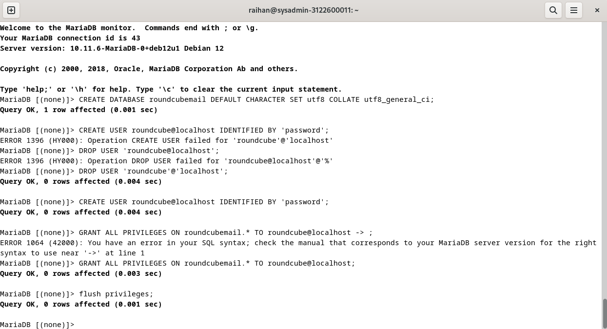

```copy code 
Nama             : Muhammad Arief Satria Wibawa
NRP              : 3122600015
Kelas            : D4 IT A
Dosen Pengampu   : Dr. Ferry Astika Saputra S.T., M.Sc
```

- # _CHAT ANTAR KELOMPOK_

## - MENGGUNAKAN TELNET

- Melakukan pengiriman pesan
  ketik `telnet mail.kelompok4.local 25` lalu masukkan sintaks berikut:
  - `HELO` untuk memulai sesi Telnet dengan server
  - `MAIL FROM:` untuk mendefinisikan alamat email pengirim
  - `RCPT TO:` untuk mendefinisikan alamat email penerima
  - `DATA` untuk memasukkan isi dari email yang dikirim
  
  
  >Jika muncul output tersebut, maka email berhasil dikirim ke alamat tujuan

- Pengecekan pesan yang masuk
  ketik `telnet mail.kelompok4.local 110` lalu masukkan sintaks berikut:
  - `user` untuk memasukkan username dari user
  - `pass:` untuk memasukkan password dari user
  - `list:` untuk melihat list dari email yang diterima
  - `RETR {index}` untuk melihat isi pesan dari index tertentu
  
  
  
## - MENGGUNAKAN DEBIAN EVOLUTION

- Melakukan pengiriman pesan
  - Masukkan email pengirim
  - Masukkan email pengirim
  - Masukkan pesan yang akan dikirim
  
  

  Jika berhasil, maka akan muncul seperti gambar berikut: 

  
  
## - MENGGUNAKAN ROUNDCUBE

1. Lakukan instalasi roundcube dengan perintah
   ```bash
   sudo apt install roundcube
   ```


2. Lalu kita buat MariaDB database dan user untuk roundcubenya



3. Lalu konfigurasi config.inc.php di roundcube.


4. Konfigurasi apache.conf.


5. Konfigurasi 000-default.conf.


6. Lalu kita rekonfigurasi dengan perintah
   ```bash
   sudo dpkg-reconfigure roundcube-core
   ```


