```copy code 
Nama             : Muhammad Arief Satria Wibawa
NRP              : 3122600015
Kelas            : D4 IT A
Dosen Pengampu   : Dr. Ferry Astika Saputra S.T., M.Sc
```

# Table of Contents
1. [Install Docker Engine on 12](#installDocker)
2. [Docker Simple Project](#dockerSimple)
3. [Docker tasks](#DockerTasks)

# _INSTALL DOCKER ENGINE ON DEBIAN 12_ <a name="installDocker"></a>

## MENGHAPUS VERSI LAMA (Jika sebelumnya pernah memasang)

Ketik `for pkg in docker.io docker-doc docker-compose podman-docker containerd runc; do sudo apt-get remove $pkg; done`:
  
  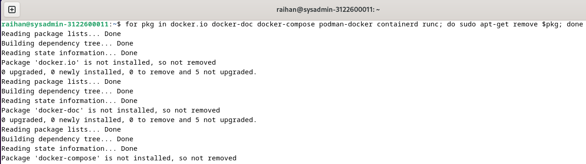

## INSTALL DENGAN REPOSITORI APT

- Masukkan command berikut ini:
  - `sudo apt-get update`:
  - `sudo apt-get install ca-certificates curl`:
  - `sudo install -m 0755 -d /etc/apt/keyrings`:
  - `sudo curl -fsSL https://download.docker.com/linux/debian/gpg -o /etc/apt/keyrings/docker.asc`:
  - `sudo chmod a+r /etc/apt/keyrings/docker.asc`:
  - `echo \
  "deb [arch=$(dpkg --print-architecture) signed-by=/etc/apt/keyrings/docker.asc] https://download.docker.com/linux/debian \
  $(. /etc/os-release && echo "$VERSION_CODENAME") stable" | \
  sudo tee /etc/apt/sources.list.d/docker.list > /dev/null`:

      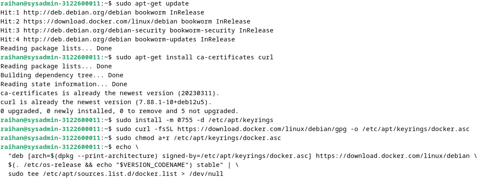
  - `sudo apt-get update`:
    
      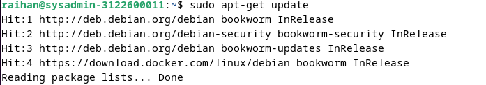
  
## INSTALL PAKET DOCKER

Untuk memasang paket versi terbaru gunakan perintah ini:
  - `sudo apt-get install docker-ce docker-ce-cli containerd.io docker-buildx-plugin docker-compose-plugin`:
    
      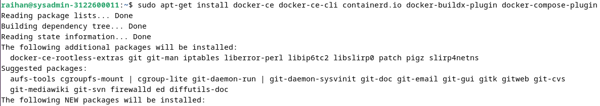
    
Cek versi Docker:
  - `docker --version`:
    
      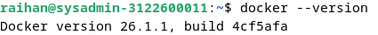

## VERIFIKASI

Untuk memverifikasi bahwa penginstalan berhasil gunakan perintah:
  - `sudo docker run hello-world`:
    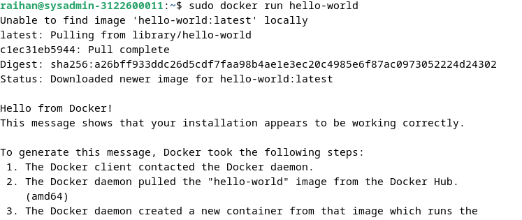


# _DOCKER SIMPLE PROJECT_ <a name="dockerSimple"></a>

## CLONE PROJECT

Lakukan git clone dari project docker-example: 
  - `git clone https://github.com/alfiyansys/docker-examples.git`
  
## BUAT IMAGE DOCKER

Masuk ke direktori docker-example: 
- `cd docker-examples`

Membuat sebuah image Docker dari sebuah Dockerfile yang ada di direktori saat ini : 
- `sudo docker build -t example .`
    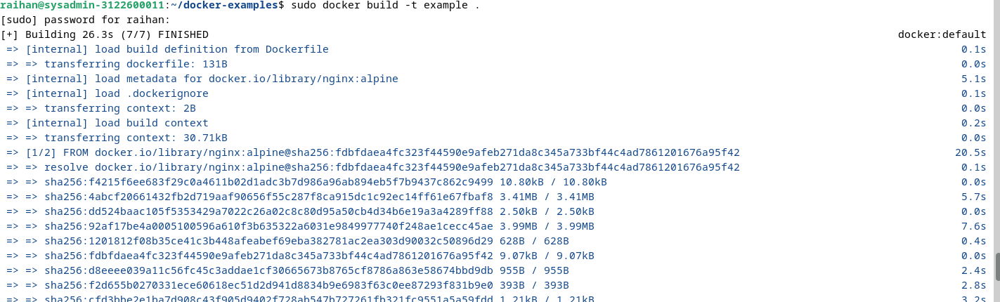

## MENJALANKAN DOCKER

Jalankan sebuah container Docker dari sebuah image yang sudah ada: 
- `sudo docker run -p 3000:80 example`
    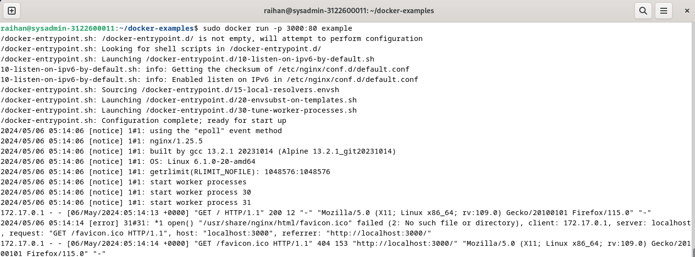
    
Jalankan pada firefox dengan mengetikkan: 
- `localhost:3000`
    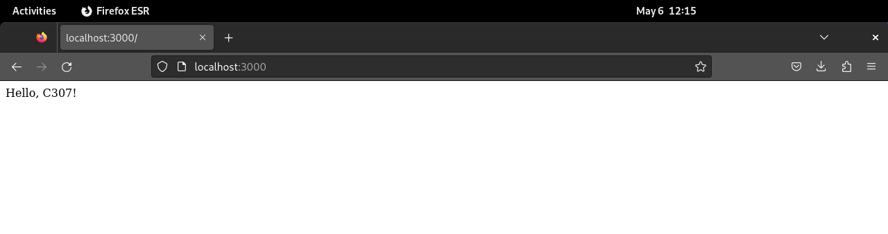

# _DOCKER TASKS_ <a name="dockerTasks"></a>
## INSTALASI UPTIME KUMA
- Ketikkan `mkdir uptime-kuma` pada direktori home
- Clone project dari github resmi dari uptime kuma dengan perintah `git clone https://github.com/louislam/uptime-kuma.git`
- Membuat file yml dengan perintah `touch docker-compose.yml`
- Mengedit isi dari file yml dengan perintah `sudo nano docker-compose.yml` dengan isi sebagai berikut : 
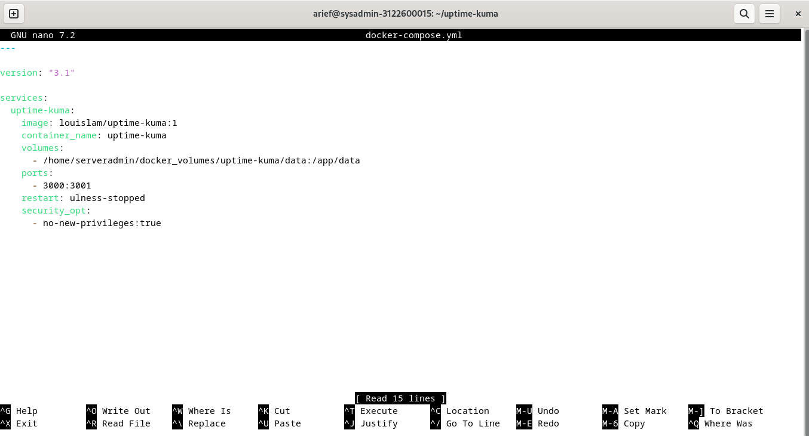
- Install Docker uptime kuma dengan perintah `sudo docker run -d --restart=always -p 3001:3001 -v uptime-kuma:/app/data --name uptime-kuma louislam/uptime-kuma:1`
- 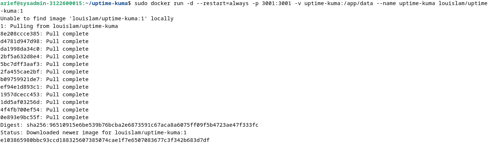
- Menjalankan perintah `docker ps` untuk memeriksa apakah suatu container sedang berjalan
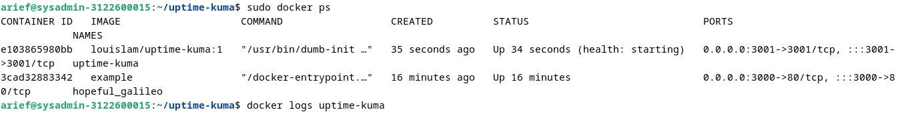
- Menjalankan perintah `sudo docker logs uptime-kuma` untuk mengecek log dari container uptime-kuma
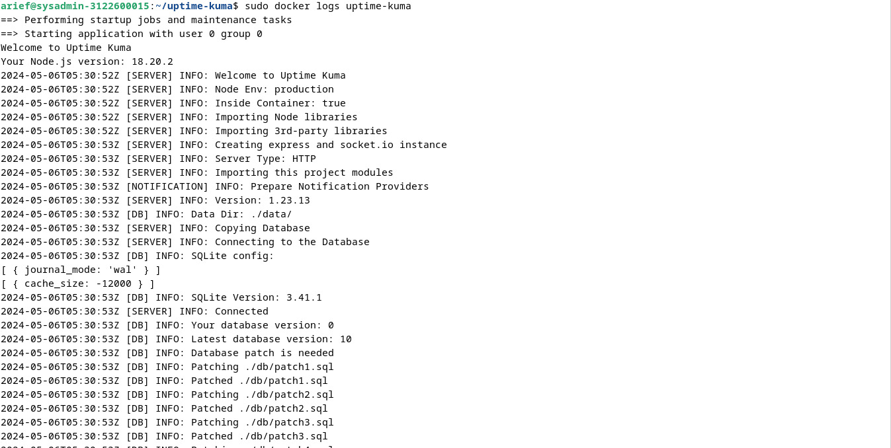
- Jika berhasil, coba jalankan di firefox dengan mengetikkan `localhost:3001` dan akan muncul tampilan berikut
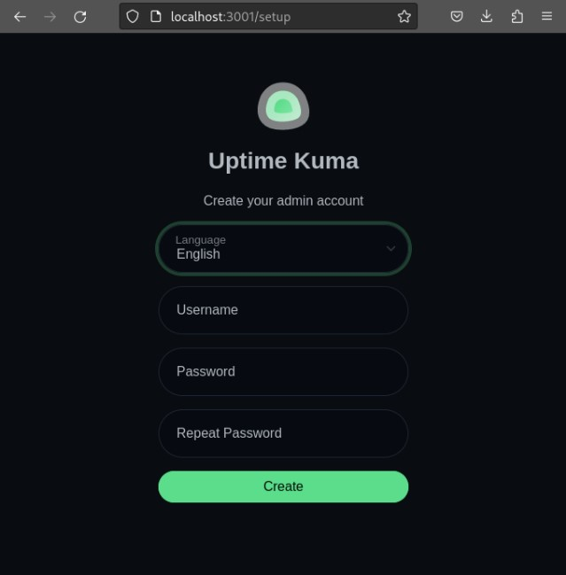

## SETTING REVERSE PROXY 