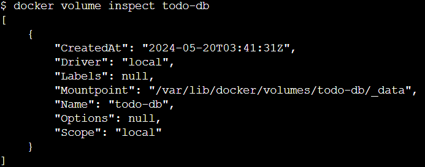
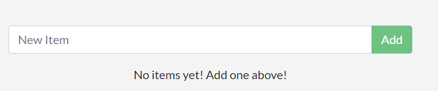

```copy code 
Nama             : Muhammad Arief Satria Wibawa
NRP              : 3122600015
Kelas            : D4 IT A
Dosen Pengampu   : Dr. Ferry Astika Saputra S.T., M.Sc
```

# Table of Contents
1. [Install Docker Engine on 12](#installDocker)
2. [Docker Simple Project](#dockerSimple)
3. [Docker tasks](#DockerTasks)

# Memulai docker 101 menggunakan playground

## Inisiasi
- Run containernya dengan menggunakan command `docker run -d -p 80:80 dockersamples/101-tutorial`

## Membuat Aplikasi
### Menggunakan aplikasi ke PWD
- Download aplikasi yang sudah disediakan dengan nama app.zip
- Upload ke labs docker dengan drag n drop file yang sudah di download
  
- Ketik command `unzip app.zip` untuk unzip file applikasinya
- Pindah direktori ke folder "app"

### Build Container image aplikasi
- Membuat file yang bernama "Dockerfile" dengan isi berikut, lalu save
    ```
    FROM node:10-alpine
    WORKDIR /app
    COPY . .
    RUN yarn install --production
    CMD ["node", "/app/src/index.js"]
    ```
- Kemudian, build container image dengan mengetikkan command `docker build -t docker-101 .`. Jika berhasil, maka akan muncul tampilan berikut
  

### Memulai App Container
- Ketikkan command `docker run -dp 3000:3000 docker-101` untuk memulai App Container baru
- Masuk ke port 3000 yang ada pada playground
  
  maka akan muncul tampilan berikut :
  

## Melakukan Update pada App
### Update Source Code
- Ubah isi dari `app/src/static/js/app.js` pada line 56 menjadi berikut : 
    ```
    - <p className="text-center">No items yet! Add one above!</p>
    + <p className="text-center">You have no todo items yet! Add one above!</p>
    ```
- Kemudian, jalankan `docker run -dp 3000:3000 docker-101`, yang mana akan muncul error sebagai berikut
  ```
  docker: Error response from daemon: driver failed programming external connectivity on endpoint laughing_burnell 
  (bb242b2ca4d67eba76e79474fb36bb5125708ebdabd7f45c8eaf16caaabde9dd): Bind for 0.0.0.0:3000 failed: port is already allocated.
  ```
  Solusi dari error ini ada pada bagain selanjutnya

### Mengganti Container lama dengan yang baru
- Mendapatkan ID dari container menggunakan command `docker ps` lalu lihat ID yang ingin di terminate

- Gunakan command `docker stop 93b64d96137e` untuk terminate containernya
- Lalu, hapus containernya menggunakan command `docker rm 93b64d96137e`
- Ketika sudah di-terminate dan dihapus, jalankan container kembali dengan command `docker run -dp 3000:3000 docker-101`
- Ketika berhasil, klik `3000` pada playground dan berikut tampilannya
  

## Sharing App
### Membuat sebuah Repo Baru
- Login pada Docker Hub, lalu create repository
    
- Beri nama repo dengan `101-todo-app`
  
- Jika berhasil, maka akan muncul pada docker hub
  
### Push Image ke Docker Hub
- Login pada username dengan menggunakan `docker login <username>` lalu masukkan password
- Jalankan command `docker tag docker-101 <username>/101-todo-app` untuk menambahkan image baru pada docker 101
- Jalankan command `docker push <username>/101-todo-app` untuk push container ke repository yang sudah dibuat
- Ketika berhasil, akan muncul pada tags
  
### Menjalankan Image pada Instance Baru
- Buat instance baru dan ketikkan command `docker run -dp 3000:3000 <username>/101-todo-app` untuk menjalankannya

## Mempertahankan DB
### Filesystem milik Container
- Mulai container ubuntu yang juga akan membuat file yang bernama `/data.txt` dengan angka acak 1 sampai 1000 dengan command `docker run -d ubuntu bash -c "shuf -i 1-10000 -n 1 -o /data.txt && tail -f /dev/null"`
- Memvalidasi output dengan mengetikkan command `docker exec <container-id> cat /data.txt` yang akan muncul angka acak berikut
  
- Kemudian jalankan container ubuntu yang lain dan kita tidak akan melihat `data.txt`
  
   Hal tersebut terjadi karena file tersebut hanya ditulis pada container yang pertama.
- Setelah itu, hapus container ubuntu tadi dengan command
  ```
  docker stop <container-id>
  docker rm <container-id>
  ```

### Mempertahankan Todo Data
- Membuat volume baru dengan command `docker volume create todo-db`
- Menjalankan container todo dengan menambahkan `-v` untuk menspesifikkan volume yang di mount, lalu masukkan command `docker run -dp 3000:3000 -v todo-db:/etc/todos docker-101`
- Kemudian, tambahkan beberapa todo list
  
- Coba untuk menghapus container todo dengan command `docker rm -f <id>`
- Lalu, coba jalankan lagi container tersebut kembali dengan command `docker run -dp 3000:3000 -v todo-db:/etc/todos docker-101`
  
  Bisa dilihat, item list yang sudah diinputkan masih ada

### Mengecek isi dari volume yang sudah dibuat
- Dengan menggunakan command `docker volume inspect <nama volume>` kita bisa melihat isi data dari volume yang sudah dibuat
  
  Mountpoint adalah tempat dimana data disimpan dalam disk. Pada tiap OS, kita memerlukan root untuk mengakses direktori ini dari host. 

## Menggunakan Bind Mounts
### Memulai Container Dev-Mode
- Memasukkan command berikut setelah memastikan bahwa tidak ada container `docker-101` yang berjalan
  ```
  docker run -dp 3000:3000 \
      -w /app -v $PWD:/app \
      node:10-alpine \
      sh -c "yarn install && yarn run dev"
  ```
- Melihat log sebelum melanjutkan ke proses selanjutnya `docker logs -f <container-id>`
  
  Jika muncul tampilan berikut, maka bisa dilanjutkan ke proses selanjutnya
- d
- Jika berhasil, akan tombol yang semula "Add Item" akan berubah menjadi "Add"
  

## Aplikasi Multi-Container
### Memulai MySQL
- Membuat networknya `docker network crate todo-app`