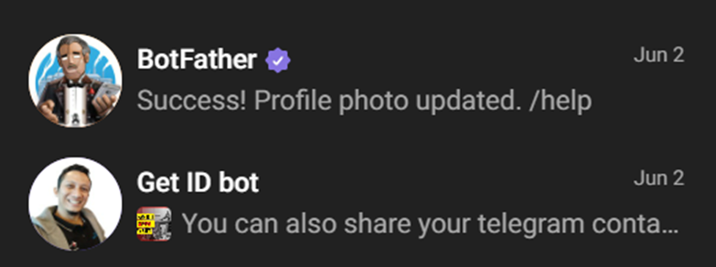
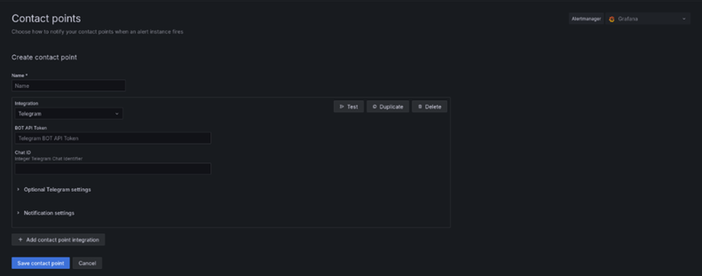
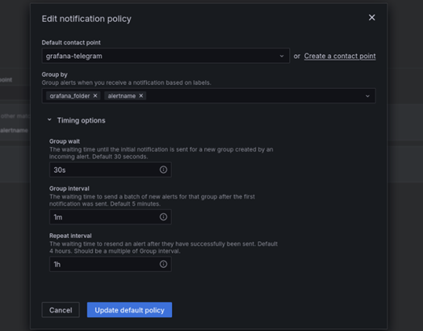
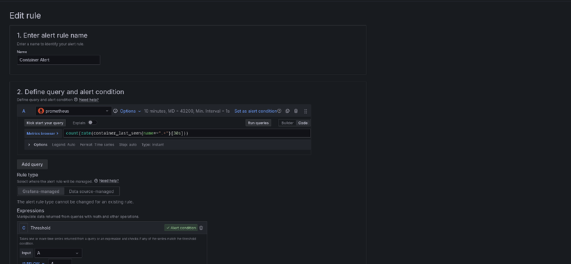
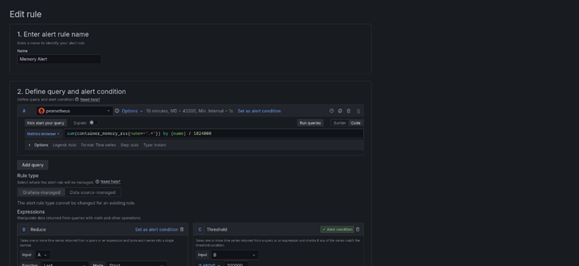
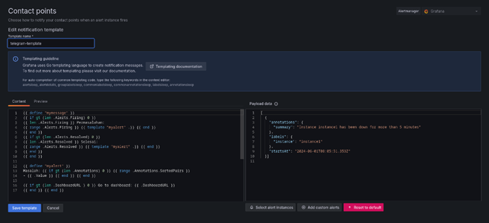
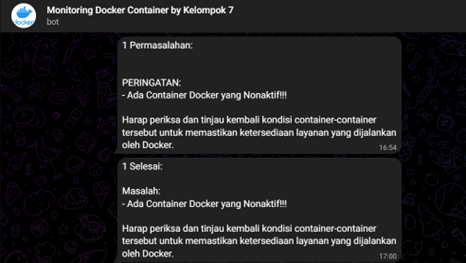

```copy code
Nama             : Muhammad Arief Satria Wibawa
NRP              : 3122600015
Kelas            : D4 IT A
Mata Kuliah      : Sistem Administrasi Jaringan
Dosen Pengampu : Dr. Ferry Astika Saputra S.T., M.Sc
```

# Proses Implementasi Pengerjaan Monitorin Docker Container
### Instalasi Docker:

### Membuat direktori baru bernama Monitoring:

### Membuat file docker-compose.yml dan prometheus.yml:

### Instalasi kontainer Prometheus, Grafana, cAdvisor pada file docker-compose.yml:

### Konfigurasi prometheus pada file prometheus.yml untuk mengumpulkan metrik:

### Mengecek kontainer:

### Mengecek metrics pada prometheus:

### Menambahkan data source baru dari prometheus:


### Tampilan kondisi kontainer pada dashboard grafana:

### Membuat bot pada telegram dengan BotFather serta Get ID bot:

### Konfigurasi Contact Points untuk telegram:

### Konfigurasi Notification Policy untuk alert:

### Konfigurasi alert rules untuk container yang mati:

### Konfigurasi alert rules untuk memory pada tiap container:

### Konfigurasi template message untuk susunan teks telegram:

### Percobaan ketika ada container yang mati:
