```copy code
Nama             : Muhammad Arief Satria Wibawa
NRP              : 3122600015
Kelas            : D4 IT A
Mata Kuliah      : Sistem Administrasi Jaringan
Dosen Pengampu : Dr. Ferry Astika Saputra S.T., M.Sc
```
    

# _PROSES IMPLEMENTASI PROJECT MONITORING DOCKER CONTAINER_

## INSTALASI DOCKER

### Menghapus Versi Lama (Jika sebelumnya pernah memasang)

- Ketik `for pkg in docker.io docker-doc docker-compose podman-docker containerd runc; do sudo apt-get remove $pkg; done`:
  
  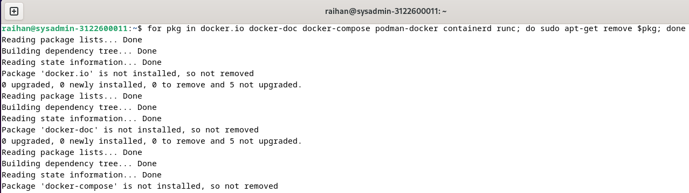

### Install Dengan Repositori APT

- Masukkan command berikut ini:
  ```
  - sudo apt-get update
  - sudo apt-get install ca-certificates curl
  - sudo install -m 0755 -d /etc/apt/keyrings
  - sudo curl -fsSL https://download.docker.com/linux/debian/gpg -o /etc/apt/keyrings/docker.asc
  - sudo chmod a+r /etc/apt/keyrings/docker.asc
  - echo \
    "deb [arch=$(dpkg --print-architecture) signed-by=/etc/apt/keyrings/docker.asc] https://download.docker.com/linux/debian \ $(. /etc/os-release && echo "$VERSION_CODENAME") stable" | \
    sudo tee /etc/apt/sources.list.d/docker.list > /dev/null
  ```
    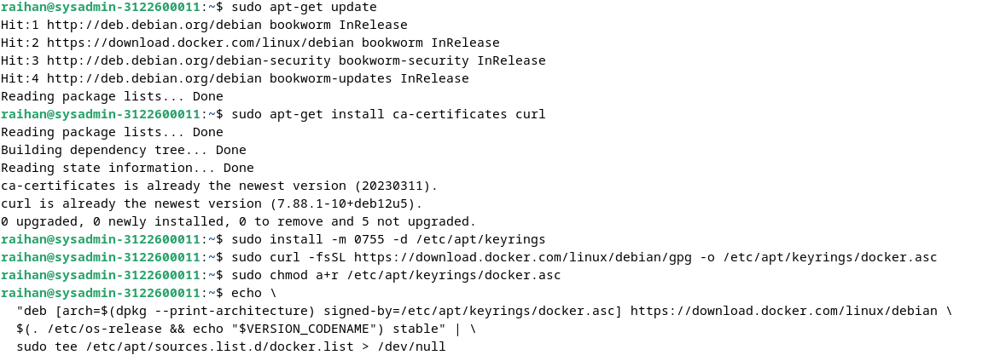
  
  - `sudo apt-get update`:
    
      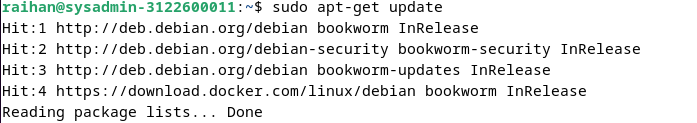
  
### Install Paket Docker

- Untuk memasang paket versi terbaru gunakan perintah ini:
  - `sudo apt-get install docker-ce docker-ce-cli containerd.io docker-buildx-plugin docker-compose-plugin`:
    
      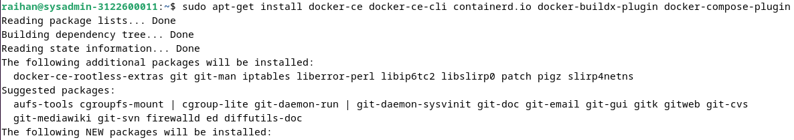
    
- Cek versi Docker:
  - `docker --version`:
    
      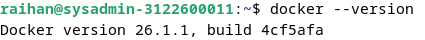

### Verifikasi

- Untuk memverifikasi bahwa penginstalan berhasil gunakan perintah:
  - `sudo docker run hello-world`:
    
      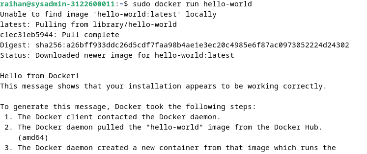

## INSTALASI PROMETHEUS, GRAFANA, CADVISOR

### Membuat Direktori Baru Untuk Monitoring

- Untuk membuat direktori baru gunakan perintah:
  - `mkdir Monitoring`:

      

### Membuat File docker-compose.yml dan prometheus.yml

- Edit isi dengan vi:
  - `vi docker-compose.yml`
  - `vi prometheus.yml`
      

- Isi dari docker-compose.yml untuk instalasi Prometheus, Grafana, cAdvisor pada docker:

  
  - Prometheus
    - image: Menggunakan image prom/prometheus:latest, yang merupakan versi terbaru dari Prometheus.
    - container_name: Menetapkan nama container sebagai prometheus.
    - ports: Memetakan port 9090 di host ke port 9090 di container, yang merupakan port default Prometheus untuk akses web.
    - command: Menjalankan Prometheus dengan file konfigurasi yang ditentukan (--config.file=/etc/prometheus/prometheus.yml).
    - volumes: Mengikat file konfigurasi prometheus.yml dari direktori lokal ke dalam container di jalur /etc/prometheus/prometheus.yml dengan akses read-only (:ro).
    - depends_on: Menentukan bahwa layanan prometheus bergantung pada layanan cadvisor, sehingga cadvisor harus dijalankan terlebih dahulu.
  
  - Grafana
    - image: Menggunakan image grafana/grafana:latest, yang merupakan versi terbaru dari Grafana.
    - container_name: Menetapkan nama container sebagai grafana.
    - ports: Memetakan port 3000 di host ke port 3000 di container, yang merupakan port default Grafana untuk akses web.
    - volumes: Menyimpan data Grafana di volume Docker bernama grafana-storage, yang di-mount ke dalam container di jalur /var/lib/grafana.

  - cAdvisor
    - image: Menggunakan image gcr.io/cadvisor/cadvisor:latest, yang merupakan versi terbaru dari cAdvisor.
    - container_name: Menetapkan nama container sebagai cadvisor.
    - ports: Memetakan port 8080 di host ke port 8080 di container, yang merupakan port default cAdvisor untuk akses web.
    - volumes:
      - (/:/rootfs:ro) Mounting root filesystem dari host ke dalam container pada direktori /rootfs dengan akses read-only. Ini bertujuan supaya cAdvisor melihat keseluruhan filesystem host.
      - (/var/run:/var/run:rw) Mounting direktori /var/run di host ke dalam container dengan akses read-write. Bertujuan supaya cAdvisor dapat mengakses informasi runtime dari Docker.
      - (/sys:/sys:ro) Mounting direktori /sys di host ke dalam container dengan akses read-only. Bertujuan untuk memberikan cAdvisor akses ke filesystem sys untuk melihat statistik kernel.
      - (/var/lib/docker/:/var/lib/docker:ro) Mounting direktori /var/lib/docker di host ke dalam container dengan akses read-only. Bertujuan memberikan akses cAdvisor ke data Docker yang penting, seperti metadata container.


- Isi dari prometheus.yml untuk mengumpulkan metrik:

  
  - Global Configuration: Menetapkan interval scraping default untuk semua target.
  - Job 'prometheus': Konfigurasi untuk melakukan scraping data dari instance Prometheus itu sendiri.
  - Job 'cadvisor': Konfigurasi untuk melakukan scraping data dari instance cAdvisor.

- Cek kontainer yang berjalan:
  - `docker ps -a`

      

## KONFIGURASI GRAFANA DASHBOARD

- Buka web grafana dengan port 3000:
  - `localhost:3000`

      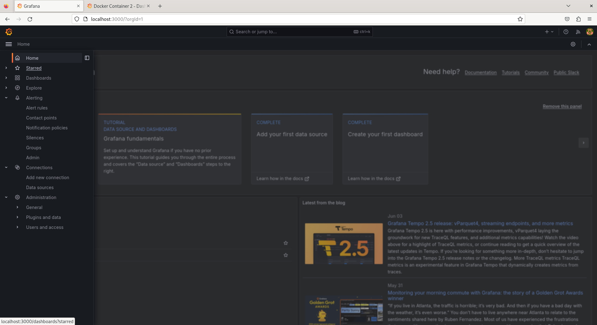

- Tambahkan dashboard untuk monitoring baru:
      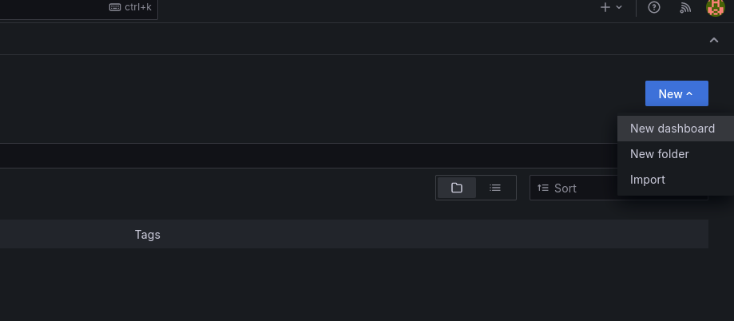

- Import template dashboard:
      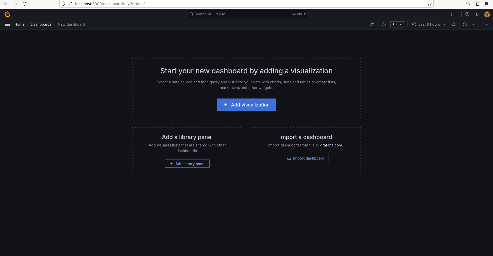

- Tambahkan ID dari template dashboard lalu tekan load:
      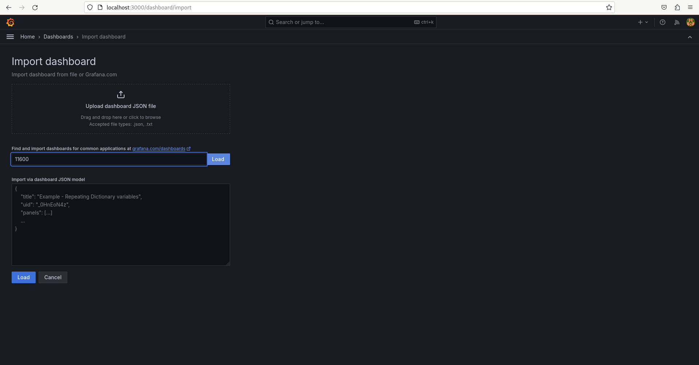

- Sesuaikan konfigurasi dashboard dan ambil dari prometheus:
      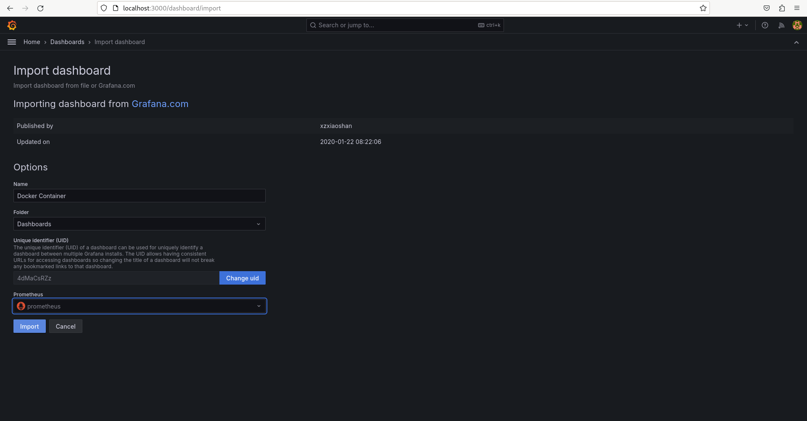

- Tampilan dashboard dari template seperti berikut:
      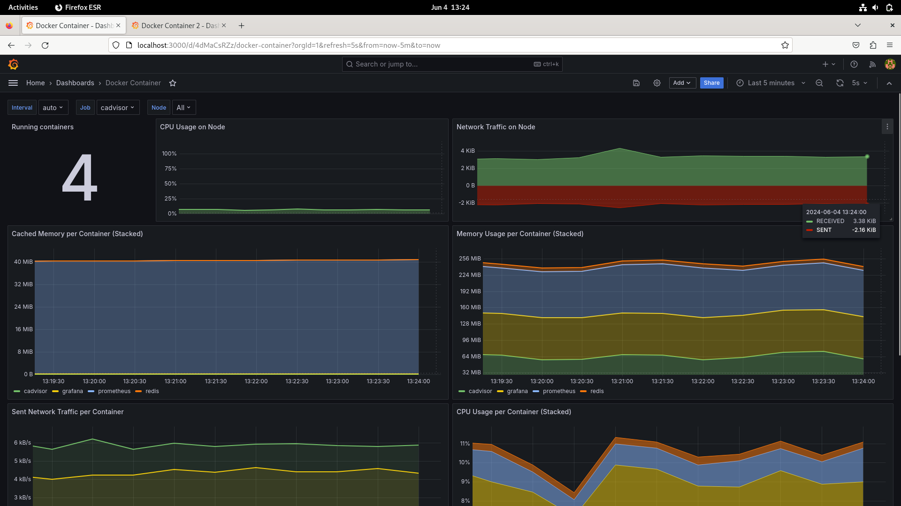

- Sesuaikan panel dan konfigurasi lain sehingga dapat menampilkan metrik yang diinginkan atau yang ingin dimonitoring:
  - Tampilan dashboard setelah dikonfigurasi ulang adalah seperti berikut.
      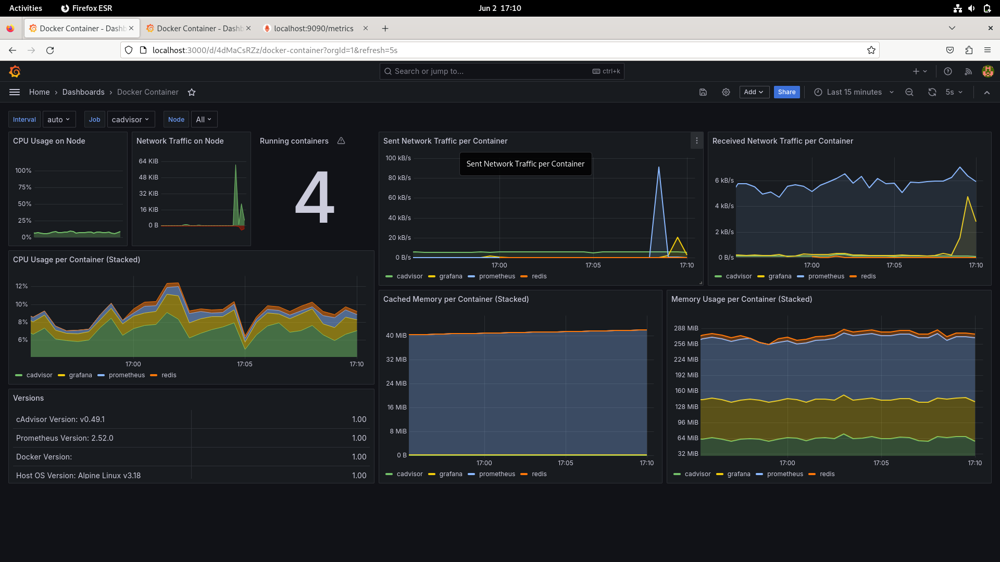
      - (CPU Usage on Node) Memantau penggunaan CPU pada host machine.
      - (Network Traffic on Node) Melacak traffic jaringan pada host machine.
      - (Running container) Menampilkan jumlah kontainer yang sedang berjalan.
      - (Sent Network Traffic per Container) Melacak traffic jaringan terkirim per kontainer.
      - (Received Network Traffic per Container) Melacak traffic jaringan yang diterima oleh kontainer tertentu. Ini melengkapi panel "Sent Network" untuk analisis traffic keseluruhan.
      - (CPU Usage per Container) Memantau penggunaan CPU per kontainer.
      - (Cached Memory per Container) Menampilkan memori cache per kontainer.
      - (Memory Usage per Container) Memantau penggunaan memori per kontainer.

## KONFIGURASI ALERT

### Membuat Bot Telegram

- Buka telegram dan search BotFather dan Get ID bot:
      

- Buat bot alert pada BotFather:
      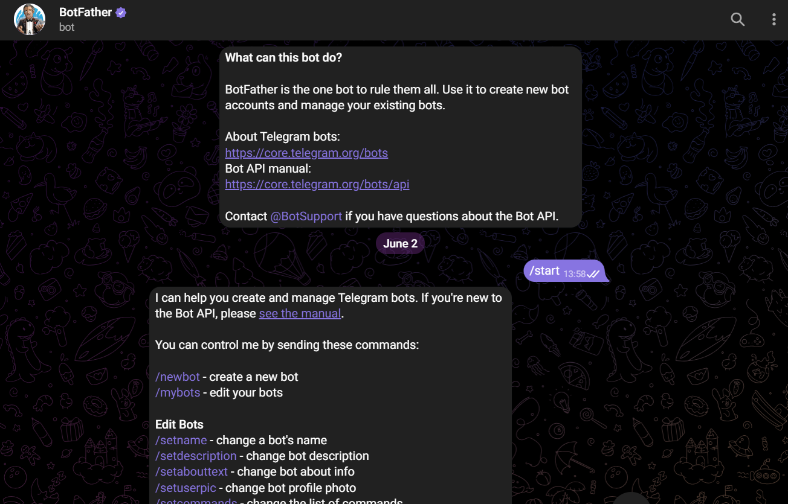

- Berikut tampilan bot yang telah dibuat:
      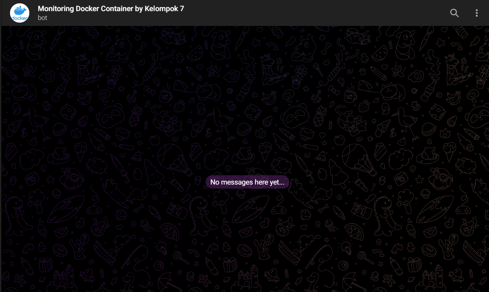

- Ikuti alurnya sehingga kita mendapatkan token API untuk mengirim data ke bot:
      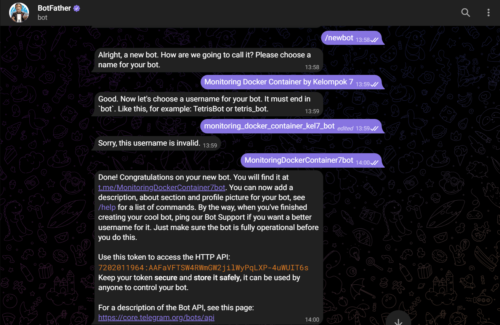

- Dapatkan ID dari telegram kita menggunakan bot Get ID bot:
      


### Menambahkan Contact Points untuk telegram
- Tambahkan token dan chat ID yang telah kita dapatkan sebelumnya:
      

### Konfigurasi Notification Policy untuk alert:


### Konfigurasi Alert Rules ketika ada container yang mati:


### Konfigurasi Alert Rules ketika ada memory container yang melebihi batas:


### Konfigurasi template message untuk susunan teks telegram:


### Percobaan ketika ada container yang mati:
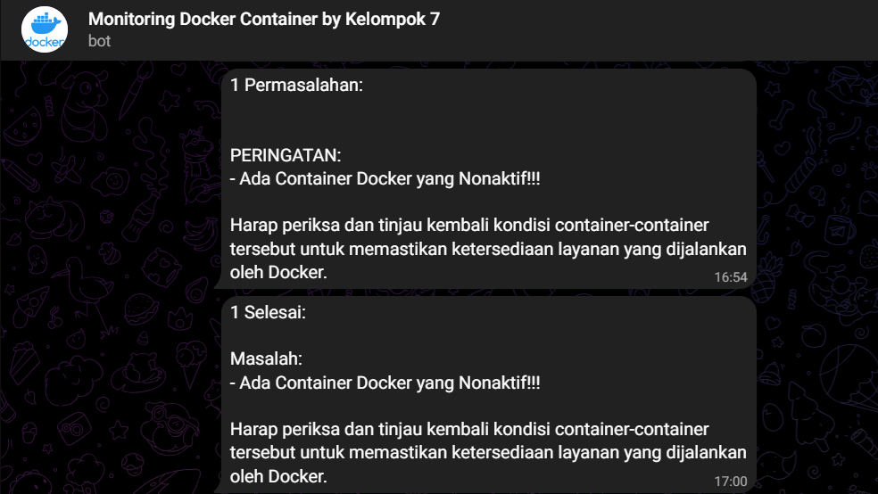
